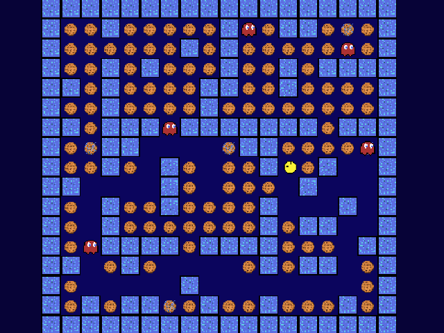

# Pacoman



Pacoman is game created for student project in [Godot game engine](https://godotengine.org/).
Control Pacoman and eat cookies scattered across the map.

## Player controls

in order to be:
move with `W`, `S`, `A`, `D` or with arrows `←`, `→`, `↑`, `↓`

## where did the idea for such a project come from?

I came up with an idea to get familiar with a new tool, which is [godot engine](https://godotengine.org/), where at the same time I'll get to know the mechanics of multithreading.
After some thinking I came up with an idea to "copy" an existing game but add some "plot twists", the choice fell on Pacman.

## multithreading

So there is multithreading in this game!

Critical section is map where ghost teleports, they can't teleport on the same spot so there is need for mutex.

at the beginning the declaration of necessary variables:

```python
var threads = [] # array for created threads
var threads_nr = 5 # thread count
var coords_for_threads = [Vector2(6+8, 0+9)] # critical section with coordinates
var destination_mutex = Mutex.new() # associated with coords_for_threads
```

next, we need create ghost as threads:

```py
for i in range(threads_nr):
    var coords = get_coordinates() # get unique coordinates for each ghost
    coords_for_threads.append(coords) # add coordinates to critical section
    threads.append(Thread.new()) # add new thread
    threads[i].start(self, "_handle_ghost", coords) # start thread as ghost
```

so... where is critical section? when we need a new destination for the spirit:

```python
destination_mutex.lock() # block from other ghosts entering
destination = get_new_destination(ghost.position) # get new coords
destination_mutex.unlock() # allow other ghosts to enter
  ```

and that's it! easy right? :P

## stages

- [x] Create threading
- [ ] create map generation
- [x] create player/enemy models
- [x] enemy moving algorithms (teleportation and movement for enemies)
- [x] map bounding
- [x] user interface
- [x] Create documentation (in-game instruction)
- [x] create graphics
- [x] music and audio effects
- [x] `you died` and `you win` screens
- [x] difficulty levels:
  - [x] teleport only (done)
  - [x] movement (change Vector2 in Ghost.gd randomly with delay [move_and_collide, move_and_slide])
  - [x] teleport with movement (combine above) [change idea for selecting new teleportation location]
